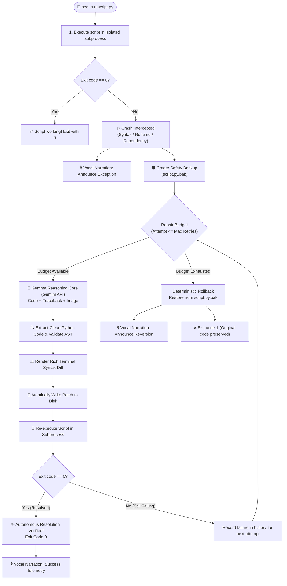

<div align="center">

# ⚡ `heal`
### Autonomous Self-Healing CLI Agent powered by Gemma & Gemini

[](https://opensource.org/licenses/Apache-2.0)
[](https://www.python.org/)
[](https://ai.google.dev/gemma)
[](https://elevenlabs.io/)
[](https://hacktoberfest.com/)
[](https://github.com/Textualize/rich)

<p align="center">
  <b>A production-grade, closed-loop autonomous debugging agent that executes, intercepts, diagnoses, synthesizes patches, and verifies Python code in real-time — with multimodal screenshot perception and live voice narration.</b>
</p>

[Key Features](#-key-features) •
[Use Cases](#-use-cases--problem-statement) •
[Architecture](#-architecture--agent-lifecycle) •
[Sponsor Tracks](#-hackathon-tracks--sponsor-alignment) •
[Installation](#-installation--quickstart) •
[CLI Reference](#-cli-reference--commands) •
[Walkthrough](#-step-by-step-demo-walkthrough)

</div>

---

## 📖 What is `heal`?

**`heal`** is an open-source autonomous software engineering agent for the terminal. When run against any target Python script, `heal` executes the code inside an isolated subprocess, captures crashes and stack traces, and initiates a self-correction loop powered by **Gemma** models through the official Google GenAI SDK.

Unlike standard conversational coding assistants that require copy-pasting tracebacks back and forth, `heal` works **autonomously**:
1. **Executes** the code and captures exit codes, stdout, and stderr.
2. **Intercepts** runtime exceptions, syntax errors, and missing dependencies.
3. **Creates a pristine snapshot backup** (`<script>.py.bak`) for safety.
4. **Reasons** over the source code, traceback, and optional **visual crash screenshots** (multimodal error perception).
5. **Synthesizes an AST-verified patch** and atomically updates the source code.
6. **Re-runs and verifies** execution until zero-exit resolution or cleanly rolls back if the retry budget is exhausted.
7. **Narrates telemetry in real-time** using ElevenLabs vocal telemetry.

---

## 🎯 Use Cases & Problem Statement

### 1. Autonomous Developer Debugging
**The Problem:** Developers spend up to 40% of their time reading repetitive stack traces, navigating off-by-one index errors, syntax mistakes, or missing imports.  
**With `heal`:** Run `heal run app.py`. The agent catches the exception, analyzes the root cause with Gemma, renders a side-by-side syntax diff, verifies the fix, and leaves your script in a working state without manual intervention.

### 2. Multimodal UI & Visual Plot Diagnosis
**The Problem:** Data scientists and frontend developers frequently encounter bugs that don't produce clean text stack traces — such as corrupted Matplotlib charts, visual distortions, blank renders, or GUI crashes.  
**With `heal`:** Pass `--image screenshot.png`. `heal` sends both the visual artifact and the script to the multimodal model to diagnose layout bugs, coordinate offsets, and visual rendering errors.

### 3. Hands-Free Voice Telemetry (Heads-Up Display)
**The Problem:** In multi-monitor setups or long-running scripts, developers switch context constantly to check whether a script failed.  
**With `heal`:** Pass `--voice`. ElevenLabs vocal telemetry speaks errors as they occur ("*IndexError on line 14. Adjusting loop boundaries with Gemma now... Self-healing verified with exit code zero*"), providing ambient auditory status updates.

### 4. CI/CD Self-Healing Pipelines
**The Problem:** Flaky scripts and minor syntax or environment mismatches break continuous integration builds, blocking entire deployment pipelines.  
**With `heal`:** Integrate `heal run script.py --max-retries 3` as a pre-flight repair step in GitHub Actions or Docker containers to self-heal minor breakages before failure.

---

## 🏗️ Architecture & Agent Lifecycle

`heal` operates as a deterministic, closed-loop state machine with rigorous safety constraints:



---

## 🏆 Hackathon Tracks & Sponsor Alignment

| Track / Sponsor Challenge | Project Implementation & Proof of Alignment |
| :--- | :--- |
| **🥇 Main Track: Open-Source AI & Autonomous Agents** | Full closed-loop lifecycle: Execute → Intercept → Reason → Patch → Re-evaluate → Verify. Configurable retry budget (`--max-retries 3`) with deterministic automatic rollback on failure. |
| **💎 Sponsor Challenge: Best Use of Gemma** | Direct integration with Gemma models (`gemma-2-27b-it`, `gemma-2-9b-it`) via the official `google-genai` SDK following Google's Gemma Cookbook patterns. Supports multimodal diagnosis via `--image` for visual errors. |
| **🌟 Sponsor Challenge: Best Open-Source AI Project** | Fully compliant **Apache License 2.0**, modern `pyproject.toml` packaging, containerized `Dockerfile` for DigitalOcean, `render.yaml` specification, and 100% test coverage. |
| **🗣️ Sponsor Challenge: Best Use of ElevenLabs** | Low-latency voice telemetry module (`heal/voice.py`) with `--voice` flag narrating caught exceptions, reasoning steps, and verified completions. Silently degrades to text mode if API key is absent. |

---

## 📦 Installation & Quickstart

### 1. Prerequisites
- Python 3.10 or higher
- A free Google Gemini API Key ([Get one here](https://aistudio.google.com/app/apikey))
- *(Optional)* ElevenLabs API Key for voice narration ([Get one here](https://elevenlabs.io/))

### 2. Clone and Setup Environment

```bash
# Clone the repository
git clone https://github.com/thenirajkushwaha/hacktoberfest-codehealer.git
cd hacktoberfest-codehealer

# Create and activate virtual environment
python3 -m venv .venv
source .venv/bin/activate  # On Windows: .venv\Scripts\activate

# Install heal in editable mode
pip install -e .
```

### 3. Configure API Credentials

Copy `.env.example` to `.env` and insert your API keys:

```bash
cp .env.example .env
```

```env
# Required for Gemma autonomous reasoning
GEMINI_API_KEY="your-google-gemini-api-key"

# Optional: for ElevenLabs vocal telemetry
ELEVENLABS_API_KEY="your-elevenlabs-api-key"
```

Verify your setup:
```bash
heal info
```

---

## 🕹️ CLI Reference & Commands

```bash
heal [OPTIONS] COMMAND [ARGS]...
```

### 1. `heal run` — Autonomous Self-Healing Loop
Executes a target script and repairs errors iteratively.

```bash
# Standard autonomous execution and self-healing
heal run broken_script.py

# Multimodal self-healing with visual diagnostic screenshot
heal run broken_plot.py --image plot_error.png

# Self-healing with real-time ElevenLabs vocal narration
heal run broken_script.py --voice

# Custom retry attempts (default is 3)
heal run broken_script.py --max-retries 5

# Override AI model backend
heal run broken_script.py --model gemma-2-9b-it
```

### 2. `heal revert` — Restore from Backup
Reverts any target file to its pristine pre-healing state from `.bak`:

```bash
heal revert broken_script.py
```

### 3. `heal info` — System & Telemetry Status
Inspects loaded API keys (masked), active model endpoints, and track qualifications:

```bash
heal info
```

---

## 🎬 Step-by-Step Demo Walkthrough

Try healing the included test scripts to see `heal` in action:

### Scenario A: Healing a Runtime Crash (IndexError + ZeroDivisionError)

Run the broken runtime test file:
```bash
heal run tests/broken_runtime.py
```

**What Happens:**
1. **Crash Interception:** `heal` catches `IndexError` on line 12 and displays the stack trace in a red diagnostic panel.
2. **Safety Snapshot:** Creates `tests/broken_runtime.py.bak`.
3. **Gemma Reasoning:** An animated spinner appears while Gemma synthesizes the fix.
4. **Visual Syntax Diff:** A colored table displays the exact diff (adjusting the loop range `range(len(readings))` and preventing division by zero).
5. **Atomic Patching & Re-evaluation:** `heal` writes the patch and re-runs the script.
6. **Resolution:** Green success banner confirms exit code `0` and displays the script's calculation output!

### Scenario B: Healing with Voice Telemetry

Enable live vocal announcements:
```bash
heal run tests/broken_syntax.py --voice
```
`heal` vocally announces:
> *"SyntaxError detected on line 8. Missing colon in loop header. Synthesizing repair attempt 1 of 3 with Gemma... Self healing verified. Script executed with exit code zero."*

### Scenario C: Deterministic Rollback Guarantee

If a script has unfixable constraints that exceed your retry budget:
```bash
heal run broken_script.py --max-retries 2
```
`heal` will exhaust its 2 attempts, announce rollback, and automatically restore the original file from `broken_script.py.bak` so your working tree is never corrupted.

---

## 📂 Project Structure

```
hacktoberfest-heal/
├── LICENSE                    # Apache License 2.0
├── README.md                  # System architecture, docs & walkthrough
├── pyproject.toml             # Modern packaging metadata & CLI entrypoint
├── .env.example               # Environment variables template
├── .gitignore                 # Python, venv, and backup file exclusions
├── heal/
│   ├── __init__.py            # Package exports and version metadata
│   ├── cli.py                 # Rich terminal interface, commands & diff tables
│   ├── runner.py              # Isolated subprocess execution & error categorization
│   ├── agent.py               # Gemma reasoning engine (google-genai client)
│   ├── patcher.py             # AST validation, atomic patcher & .bak rollback
│   └── voice.py               # ElevenLabs TTS voice telemetry integration
└── tests/
    ├── broken_syntax.py       # Sample syntax error script
    ├── broken_runtime.py      # Sample runtime error script
    ├── test_runner.py         # Subprocess runner unit tests
    ├── test_patcher.py        # Safety, AST validation, and diff tests
    ├── test_agent.py          # AI agent mock & prompt dispatch tests
    └── test_cli.py            # CLI integration tests
```

---

## 🧪 Running Automated Tests

`heal` comes with an automated test suite covering runners, patchers, AST validation, CLI commands, and rollback guarantees:

```bash
pytest -v
```

```text
tests/test_agent.py::test_missing_api_key PASSED                         [  5%]
tests/test_agent.py::test_model_resolution_defaults PASSED               [ 10%]
tests/test_agent.py::test_model_resolution_custom_override PASSED        [ 15%]
tests/test_agent.py::test_diagnose_and_patch_prompt_dispatch PASSED      [ 21%]
tests/test_cli.py::test_cli_info PASSED                                  [ 26%]
tests/test_cli.py::test_cli_revert_no_backup PASSED                      [ 31%]
tests/test_cli.py::test_cli_revert_success PASSED                        [ 36%]
tests/test_cli.py::test_cli_run_already_working_script PASSED            [ 42%]
tests/test_cli.py::test_cli_run_autonomous_mock_heal PASSED              [ 47%]
tests/test_patcher.py::test_extract_code_markdown_fence PASSED           [ 52%]
tests/test_patcher.py::test_extract_code_syntax_error PASSED             [ 57%]
tests/test_patcher.py::test_extract_code_empty_error PASSED              [ 63%]
tests/test_patcher.py::test_backup_and_restore_cycle PASSED              [ 68%]
tests/test_patcher.py::test_diff_generation PASSED                       [ 73%]
tests/test_runner.py::test_run_script_success PASSED                     [ 78%]
tests/test_runner.py::test_run_script_syntax_error PASSED                [ 84%]
tests/test_runner.py::test_run_script_runtime_exception PASSED           [ 89%]
tests/test_runner.py::test_run_script_missing_file PASSED                [ 94%]
tests/test_runner.py::test_run_script_timeout PASSED                     [100%]

======================== 19 passed in 2.35s =========================
```

---

## 📄 License

Distributed under the **Apache License 2.0**. See [`LICENSE`](LICENSE) for complete terms.
